# 관계도

> 도현 중심 노드. 인물 노드는 별명·호칭·관계어로만. 풀네임 사용 금지.
> 새 인물 추가 시 character-keeper가 갱신안 제시 → 사용자 확정 후 이 파일 편집.

```mermaid
graph TD
  도현["강도현 (26세)"]

  %% 혈연 (부재·단절)
  어머니["어머니 (얼굴 모름 / 출산 직후 사라짐)"]
  아버지["아버지 (마담뚜 / 간경화 / 행방불명)"]
  도현 --"사라진 원점"--> 어머니
  도현 --"맞고 자람 / 보육원 행"--> 아버지

  %% 현재 관계
  현재누나["현재 누나 (원룸 소파)"]
  도현 --"멍 / 침묵"--> 현재누나

  %% 보육원
  보육원["보육원 선생들 (경기도 외곽)"]
  정선생["정선생 (침묵 / 책상 모서리 사건 격리)"]
  그새끼["같은 방 그 새끼 (책상 모서리 / 머리에 피)"]
  빵아줌마["빵 주던 아줌마 (보육원, 퇴사 후 회상 작동)"]
  도현 --"벌방"--> 보육원
  도현 --"이게 더 무서움"--> 정선생
  도현 --"세 번. 도망갈 데 없음."--> 그새끼
  도현 --"빵 냄새 = 회상 트리거"--> 빵아줌마

  %% 거리기 초반 (10세, 영등포)
  옷형["옷 준 그 형 (이름 안 알려줌 / 안 때린 사람)"]
  컵라면아저씨["컵라면 준 아저씨 (받자마자 도망)"]
  도현 --"이상한 사람 / 자기 손 안 무서워함"--> 옷형
  도현 --"왜 도망갓는지는 모름"--> 컵라면아저씨

  %% 거리 인맥 (유동, 청년기)
  거리형들["거리 형들 (구치소 인맥)"]
  도현 --"약 / 일거리"--> 거리형들

  %% 과거 누나들 (유동·반복 패턴)
  과거누나들["과거 누나들 (단란주점·안마방·모텔)"]
  도현 --"들러붙음 → 파괴 → 문 앞 대기"--> 과거누나들

  %% 동생들 (유동·반복 패턴)
  동생들["거리 동생들 (가출 청소년)"]
  도현 --"라면·약·손찌검"--> 동생들

  %% 제도적 관계
  상담사["보호관찰 상담사"]
  도현 --"노트 받음 / 흘려들음"--> 상담사

  %% 스타일
  classDef 부재 fill:#2a2a2a,stroke:#555,color:#aaa
  classDef 현재 fill:#1a1a2e,stroke:#4a4a8a,color:#ccc
  classDef 유동 fill:#1a1a1a,stroke:#333,color:#888
  classDef 보육원기 fill:#1a2a1a,stroke:#3a5a3a,color:#9aaa9a
  classDef 거리초반 fill:#2a1a1a,stroke:#5a3a3a,color:#aa9a9a
  class 어머니,아버지 부재
  class 현재누나 현재
  class 과거누나들,동생들,거리형들 유동
  class 보육원,정선생,그새끼,빵아줌마 보육원기
  class 옷형,컵라면아저씨 거리초반
```

---

## 관계 패턴 요약

| 유형 | 도현의 역할 | 시작 | 끝 |
|---|---|---|---|
| 손위 여자(누나) | 동생 | 들러붙음, 다정함 수용 | 도현이 먼저 파괴 또는 사라짐 |
| 손아래(동생) | 형 | 라면·약으로 끌어당김 | 동생이 도현 털고 사라지거나, 도현이 끊음 |
| 자기 폭력 거부 안 하는 사람 | 둘 다 | 가장 격렬하게 시작 | 응급실 또는 이사. 도현이 가장 오래 무너짐 |
